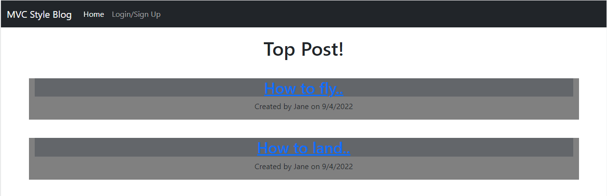

# MVC-Tech-Blog

  ## Description

  

  I wanted to build a full-Stack blog. It gave me practice with express routes and mySQL models. It lets people talk to each other and comment on their posts. I learned a lot and to double check fetch routes.

  I have also deployed it as a [Heroku app](https://mvc-style-blog.herokuapp.com/).

  # Table of Contents
  1. [Description](#description)
  2. [Installation](#installation)
  3. [Usage](#usage)
  4. [Contributing](#contributing)
  5. [Tests](#tests)
  6. [Questions](#questions)

  ## Installation

  ``` git clone ``` the repo.
  Then run,
  ``` npm run seed ```
  to seed the data base.

  ## Usage

  Run, ``` npm start ```
  to start up a local server. Then you can sign up, log in, create, delete, and update posts, and comment on said posts.

  ## Contributing

  You can fork or just make a pull request.

  ## Questions

  You can send me any additional questions at my email Nabhahnk@gmail.com.

  My [GitHub](https://github.com/NabhahnK)

### License
    
  [](http://www.wtfpl.net/about/)
  
  http://www.wtfpl.net/about/